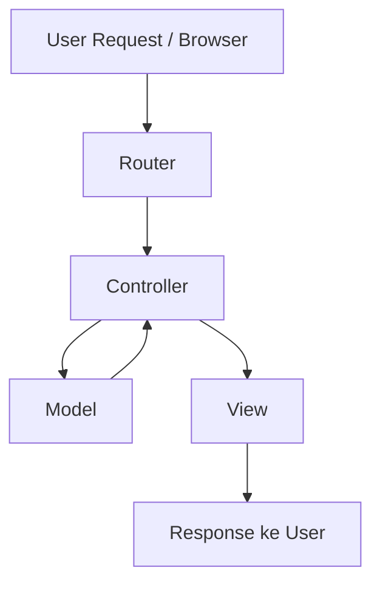
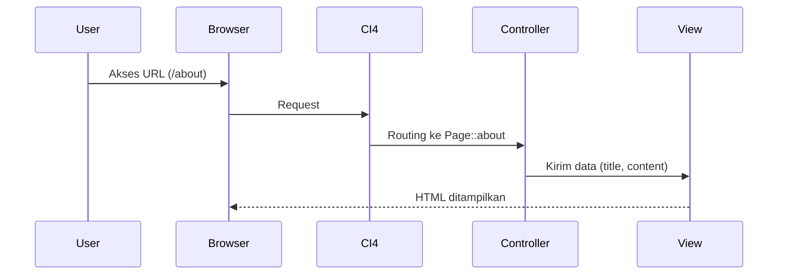
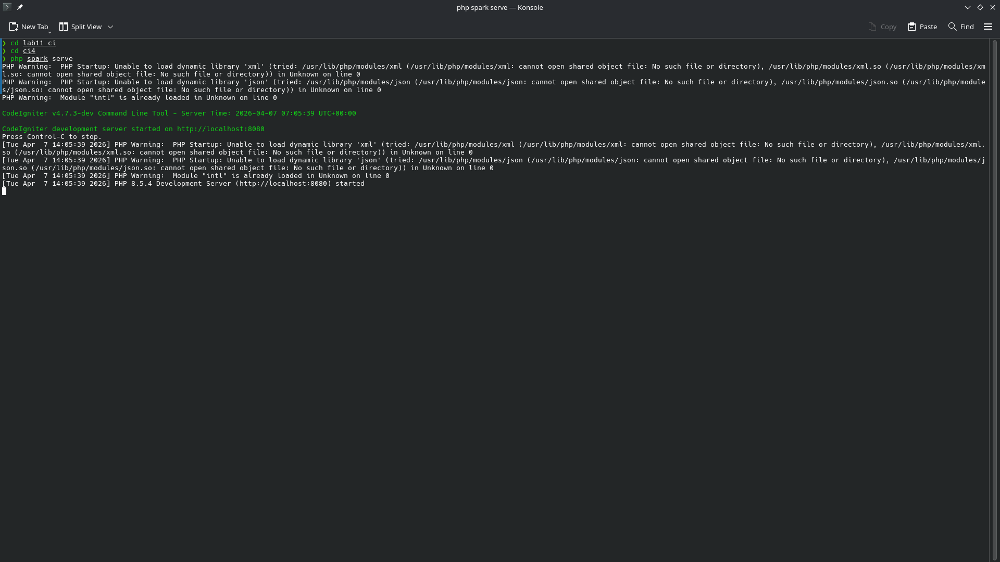
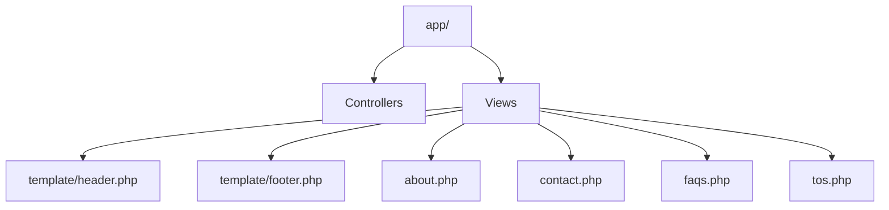
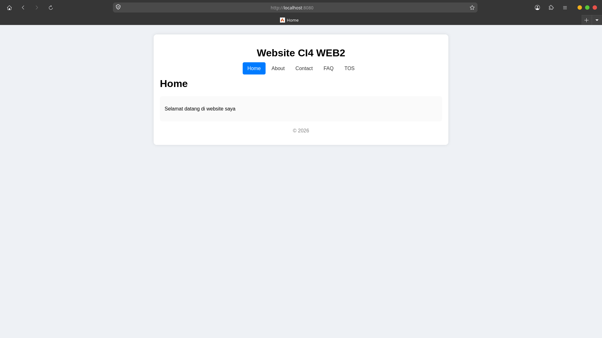
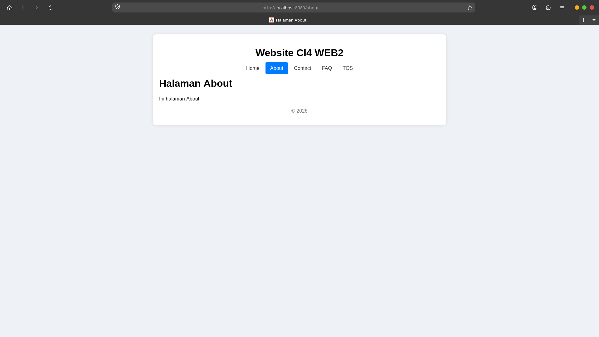
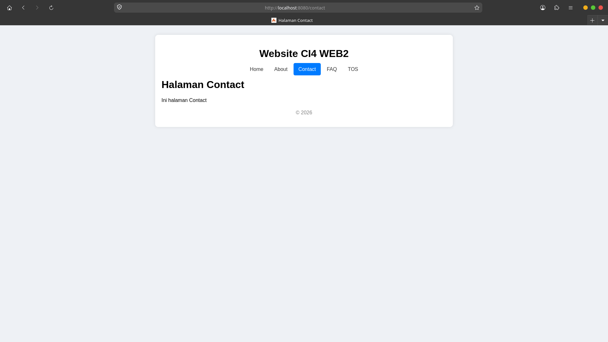
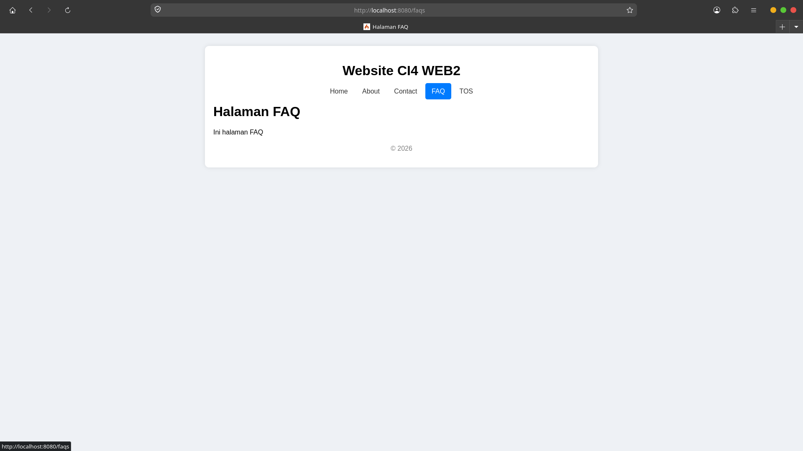
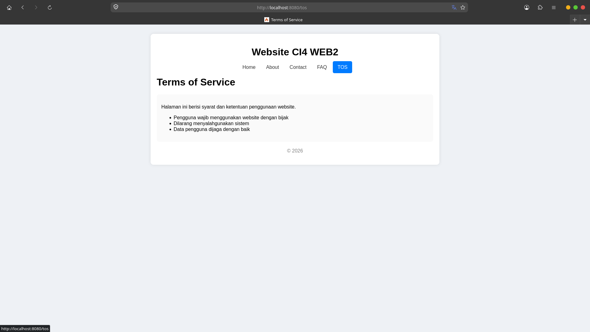

# Web2_Praktikum_1-4
# Praktikum 1 - CodeIgniter 4 (MVC)

## Deskripsi

Modul Praktikum 1 ini bertujuan untuk memahami konsep dasar **Framework CodeIgniter 4** dan arsitektur **MVC (Model-View-Controller)**.
Mahasiswa diharapkan mampu membuat aplikasi web sederhana dengan routing, controller, dan view.

---

## Konsep MVC (Diagram)



**Penjelasan:**

* **Router** → Menentukan controller mana yang dipanggil
* **Controller** → Mengatur alur logika
* **Model** → Mengelola data
* **View** → Menampilkan ke user

---

## Alur Aplikasi CI4



---

## Cara Menjalankan (Linux Native PHP)

Jalankan perintah berikut di terminal:

```bash
php spark serve
```


Kemudian buka browser:

```
http://localhost:8080
```

Penjelasan:

* `php spark serve` → Menjalankan server bawaan CodeIgniter
* Tidak perlu Apache/XAMPP
* Cocok untuk Linux seperti CachyOS

---

## Struktur Folder (Sederhana)



---

## Tampilan Aplikasi

---

### Home



**Penjelasan:**
Halaman utama website yang menampilkan pesan selamat datang.
Menggunakan template layout (header & footer).

---

### About



**Penjelasan:**
Menampilkan informasi tentang website.
Data dikirim dari controller ke view menggunakan array.

---

### Contact



**Penjelasan:**
Halaman kontak sederhana.
Menampilkan informasi kontak menggunakan struktur MVC.

---

### FAQ



**Penjelasan:**
Berisi pertanyaan umum (Frequently Asked Questions).
Menggunakan layout yang sama untuk konsistensi UI.

---

### Terms of Service (ToS)



**Penjelasan:**
Menampilkan syarat dan ketentuan penggunaan website.
Ditambahkan sebagai pengembangan dari tugas utama.

---

## Kesimpulan

* Framework CodeIgniter mempermudah pengembangan web
* Konsep MVC membuat kode lebih terstruktur
* Routing menghubungkan URL dengan controller
* View digunakan untuk tampilan
* Controller sebagai penghubung utama

---

## Catatan

Project ini dijalankan menggunakan:

* PHP Native (CLI)
* CodeIgniter 4
* Linux (CachyOS)

---
